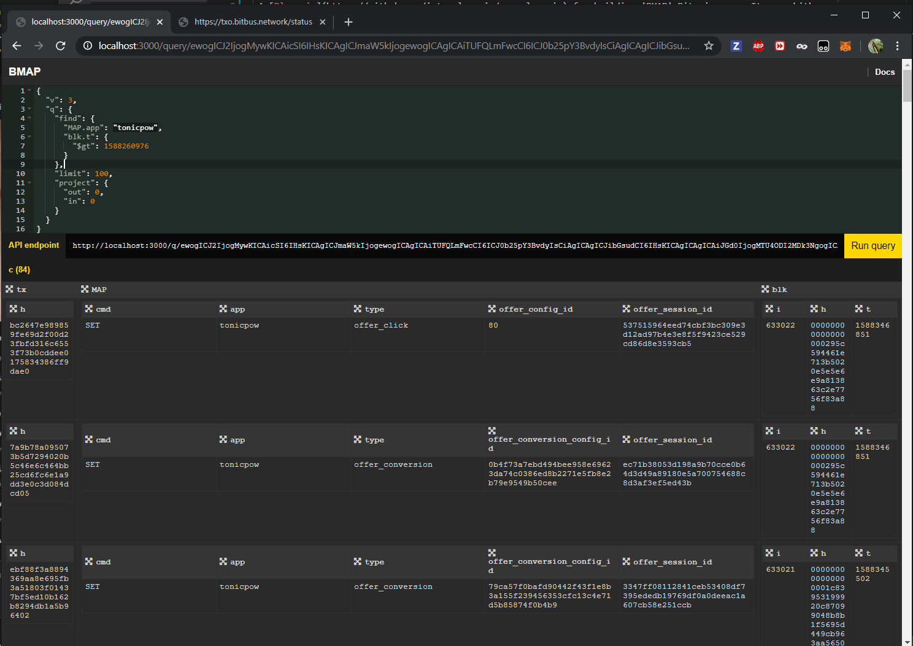

# chronos-api

This API is hosted publicly at https://chronos.map.sv

It is a Bitcoin transaction indexer and API for building real-time Bitcoin apps. It uses [junglebus](https://junglebus.gorillapool.io) to crawl for transactions and transforms them with [bmapjs](https://bmapjs.com). It automatically prunes transactions 24h old. It runs two processes:

## Crawler

A crawler and indexer that saves transaction data into a MongoDB database.

## API

A REST API supporting BitQuery syntax.



```json
{
  "find": {
    "MAP.app": "jamify.xyz"
  }
}
```

It then provides support for a number of known OP_RETURN protocols making queries nicer:

```json
{
  "find": {
    "BITPIC.paymail": "satchmo@moneybutton.com"
  }
}
```

For a full list of what protocols are supported see [bmapjs.com](https://bmapjs.com)

It also makes working with the results from your frontend much friendlier

```js
let res = await fetch("https://chronos.map.sv/q/...");
let j = res.json();
console.log("Got tx", j[0].tx.h, "app:", j[0].MAP.app);
```

## Socket

Using the same query syntax you can listen for changes:

```js
var sock = {
  "v":3,
  "q":{
    "find":{
      "MAP.type": {"$in": ["post","message"]}, 
    },
    "sort": {
      "blk.t": -1
    }
  }
}
```

```js
var sock_b64 = btoa(JSON.stringify(sock))
var socket_url = 'https://chronos.map.sv/s/'+sock_b64

  // socket
  bmapSocket = new EventSource(socket_url)
  bmapSocket.onmessage = function(e) {
    var res = JSON.parse(e.data)
    if (res.type === 'push') {
      // do something with res.data
    }
  }
```

# Install

### Prerequisites

Docker & Docker-Compose

### Run Locally

Install dependencies

```bash
yarn
```

Start the app (make sure your env vars are set first)

```bash
yarn start
```

### Run in docker

Build the image

```bash
docker build -t chronos-api.
```

Start the app
`bash
docker-compose up

````

### Configuration

`config.js` hold config values.

Set the `from` value to the block to begin indexing.

#### Install MongoDB

To run locally you will need mongodb installed.

See their [installation guide](https://docs.mongodb.com/manual/installation)

# Config

Set the following environmental variables:

- `CHRONOS_MONGO_URL` A connection string to your mongo database. ex: mongodb://localhost:27017/bmap when running locally, or mongodb://mongo:27017/bmap from within a container.

# Run

```bash
node index
````

# More Examples

With BitQuery you can search in all sorts of ways.

#### Records within the last 24 hours:

1. Set a timestamp in the expected format.

```js
let timestamp = Math.floor(new Date().getTime() / 1000 - 86400);
```

2. Search for records since that timestamp:

```json
{
  "v": 3,
  "q": {
    "blk.t": { "$gt": <timestamp> }
  }
}
```

# BMAPjs

This API returns data in BMAP format which is a derivative of [BOB](https://github.com/interplanaria/bpu):
[BMAPjs](https://github.com/rohenaz/bmap)

[bmapjs.com](https://bmapjs.com)
